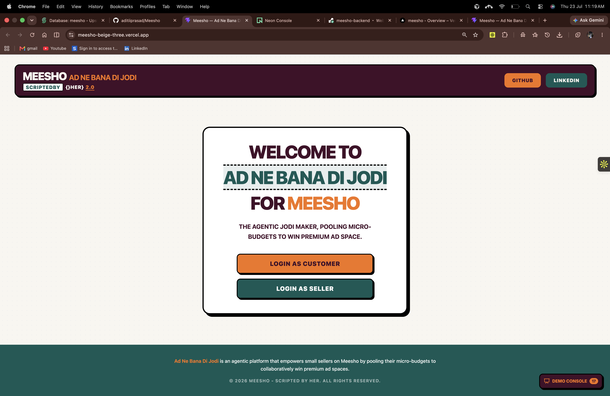
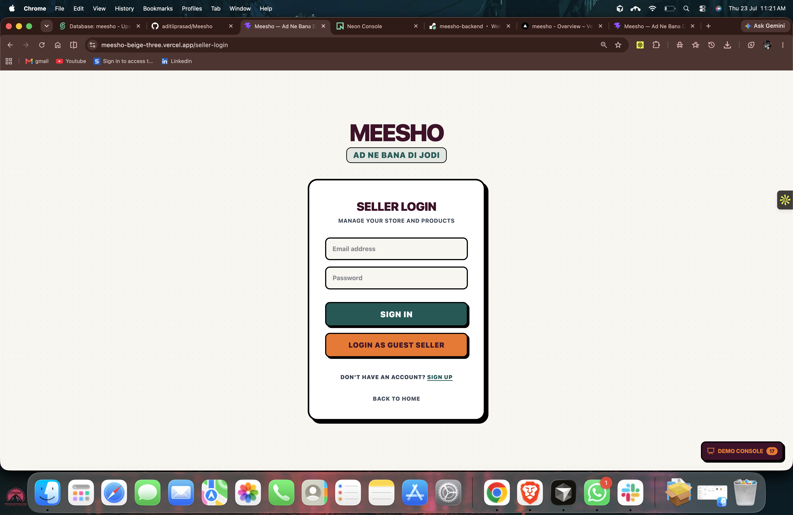
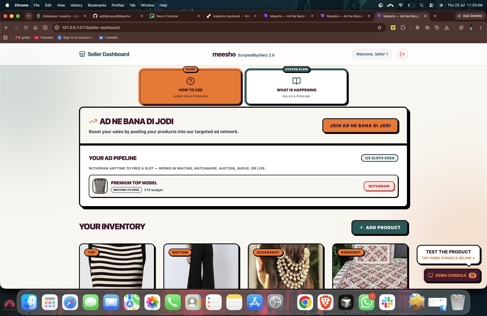
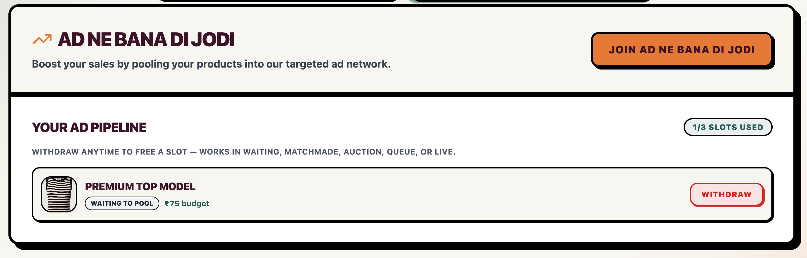
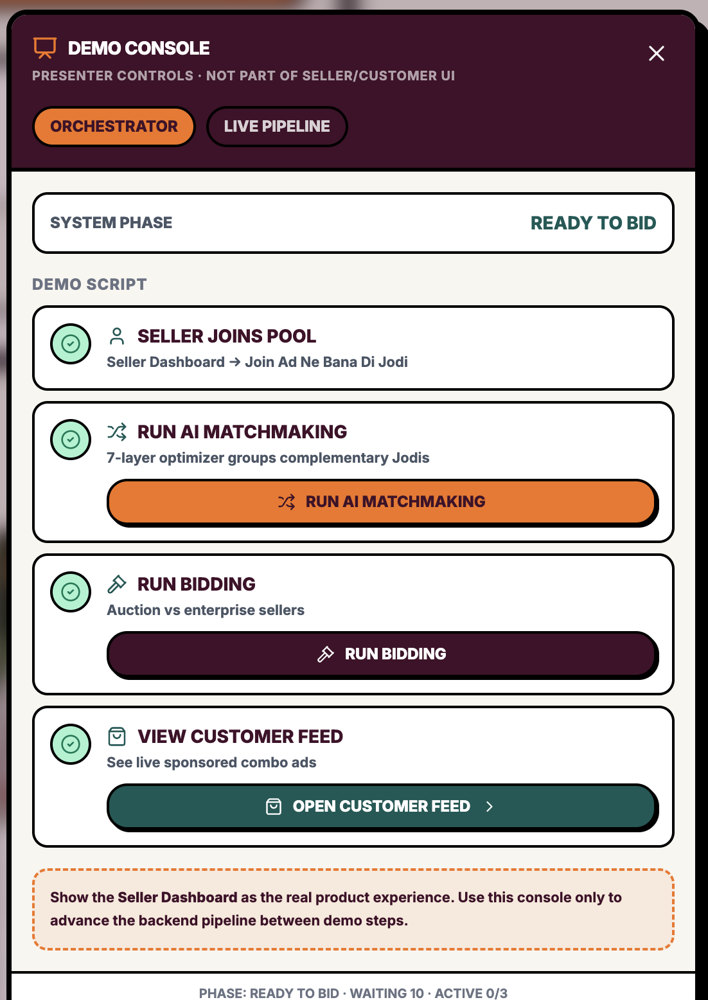
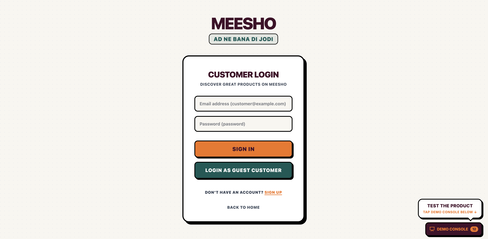
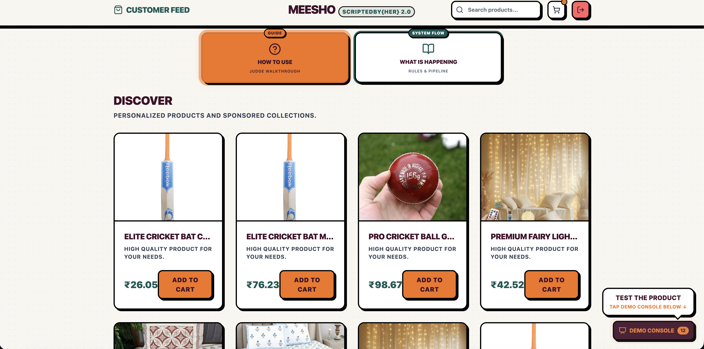
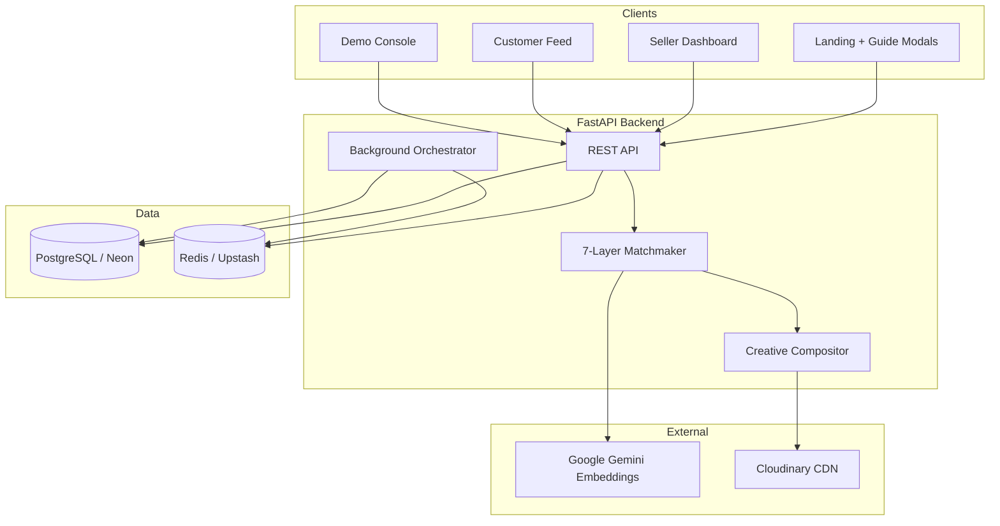
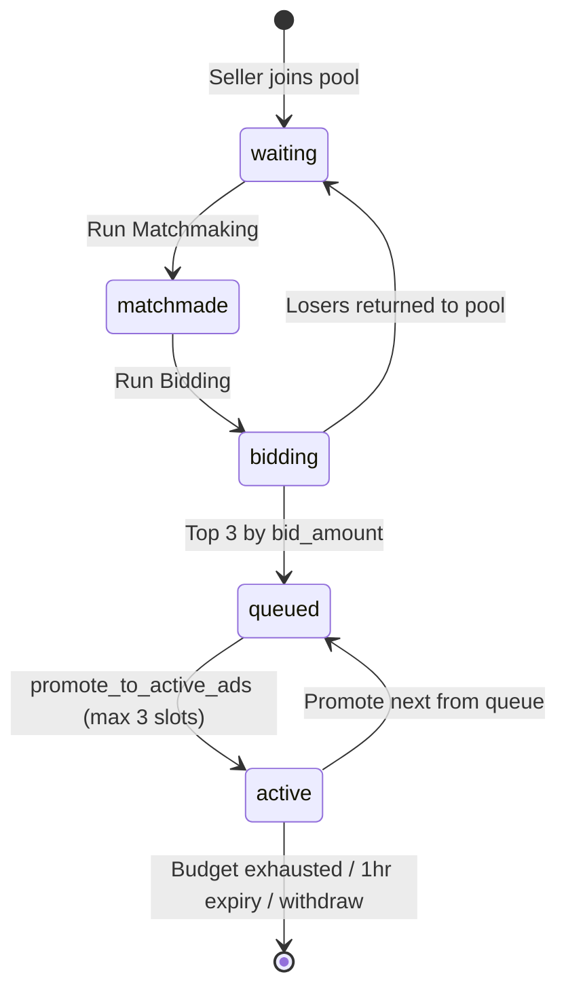
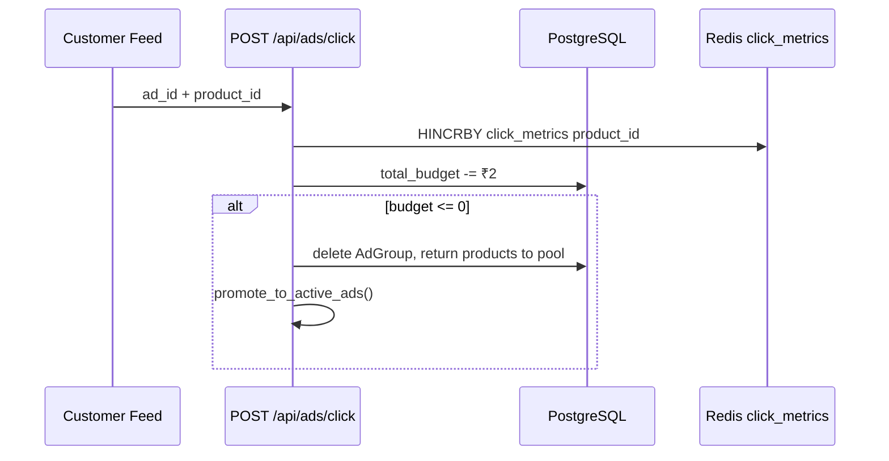

# Ad Ne Bana Di Jodi — Meesho Hackathon

> **ScriptedBy{Her} 2.0** · Collaborative Ad-Pool for Micro-Sellers on Meesho

## Live demo (submission)

| | URL |
|---|-----|
| **App (submit this link)** | https://meesho-beige-three.vercel.app |
| Backend API | https://meesho-backend-wgsi.onrender.com |
| Repository | https://github.com/aditiiprasad/Meesho |

**Quick judge flow:** Landing → **How to Test Demo** → **Guest Seller** → join pool → **Demo Console** (bottom-right) → matchmake → bid → **Guest Customer** → click ad → back to seller **Active Campaigns**.

**Guest accounts:** `seller1@test.com` / `password` · `customer@example.com` / `password` (or use **Guest** buttons on login pages).

---

## Page-by-page overview

Screenshots live in the [`demo/`](demo/) folder at the repo root. Add PNG/JPG files using the names below — the README will display them automatically once uploaded.

Every main screen also has **How to Use** and **What Is Happening** buttons at the top (same as the landing page) for in-app judge guidance.

---

### 1. Landing page



| | |
|---|---|
| **Route** | `/` |
| **Purpose** | Entry point — choose Seller or Customer role |

**How to use (from in-app guide):**
- Start here before testing.
- Open **How to Test Demo** for the full walkthrough.
- Open **What Actually Happens** for system rules and pipeline.
- Use **Login as Seller** or **Login as Customer** (or register).

**What happens:**
- No backend logic on this page — routing only.
- Links to GitHub profile, **Repository**, and LinkedIn in the header.

---

### 2. Seller login



| | |
|---|---|
| **Route** | `/seller-login` |
| **Purpose** | Authenticate as a micro-seller |

**How to use:**
- Click **Login as Guest Seller** (fastest for judges).
- Or sign in with `seller1@test.com` / `password`.

**What happens:**
- Validates credentials against Postgres (production) or SQLite (local demo).
- Redirects to **Seller Dashboard** on success.

---

### 3. Seller dashboard



| | |
|---|---|
| **Route** | `/seller-dashboard` |
| **Purpose** | Pool products, track pipeline, view live campaign metrics |

**How to use:**
1. Open **Ad Ne Bana Di Jodi** → pick a product, set budget **₹50–₹150** → **Decide to Pool**.
2. Scroll to **Your Ad Pipeline** — stage should show **Waiting to Pool**.
3. Max **3 products** in the pipeline per seller at once.
4. **Withdraw** anytime to free a slot (works at every stage).

**What happens (Step 1 — Join pool):**
- Eligibility check: product rating ≥ 4.0, return rate &lt; 10%, seller monthly ad spend &lt; ₹150.
- Product enters the **Waiting Pool** with your budget.
- Pool is auto-seeded with ~15–30 catalog products so trios can form even with one real seller.



**How to use (metrics phase):**
- After bidding, if your Jodi is **Live**, see **Active Campaigns** with **Clicks**, **Spend**, and **Sales Generated** per product.

**What happens (live metrics):**
- Clicks tracked **per product** in Redis (₹2 per click).
- Spend = clicks × ₹2; Sales = demo formula (clicks × 0.12 × ₹80).
- Pipeline stages: **Waiting** → **Matchmade** → **In Auction** → **In Queue** → **Live**.

---

### 4. Demo Console (presenter controls)



| | |
|---|---|
| **Location** | Floating button, bottom-right (all pages) |
| **Purpose** | Run matchmaking & bidding; view live pipeline buckets |

**How to use:**
1. Click the blinking **Demo Console** button.
2. **Run Matchmaking** → seller pipeline moves to **Matchmade**.
3. **Run Bidding** → **In Queue** or **Live** on customer feed.
4. Watch **Live Pipeline** tabs: Waiting · Matchmade · Bidding · Queue · Active.

**What happens:**
- **Run Matchmaking** → 7-Layer Jodi Maker groups 3 products into a 900×300 combo banner (`status = matchmade`).
- **Run Bidding** → pooled Jodis vs 5 simulated enterprise ads; top **3 bids** win → queue → up to **3 active** feed slots.
- Losers return to waiting pool with budget split proportionally.
- Matchmaking & bidding are **manual** in the demo for a clear presenter narrative (production can auto-run).

---

### 5. Customer login



| | |
|---|---|
| **Route** | `/customer-login` |
| **Purpose** | Browse feed as a shopper |

**How to use:**
- Log out from seller (top-right) → home → **Login as Customer** → **Login as Guest Customer**.

**What happens:**
- Same auth pattern as seller; redirects to **Customer Feed**.

---

### 6. Customer feed



| | |
|---|---|
| **Route** | `/customer-feed` |
| **Purpose** | Product discovery + sponsored Jodi combo ads |

**How to use:**
1. Find the **Sponsored Combo** banner (interleaved in the feed).
2. Click a **product zone** in the ad — click is attributed to that seller’s product.
3. Valid Jodis show *“A perfect match curated for you.”*
4. If the pool lacked cross-category products, a **No valid trio** warning appears (fallback combo still shown).

**What happens (Steps 6–8):**
- Max **3 ads live** on feed; runtime **1 hour** (background orchestrator every 30s).
- Each click debits **₹2** from the shared Jodi budget.
- Budget exhausted or ad expired → ad removed → next queued ad promotes → products can re-enter pool.

---

### In-app guide modals (optional screenshots)


**How to Test Demo** — 4-phase judge walkthrough: Seller pool → Demo Console → Customer clicks → Seller metrics.


**What Is Happening** — full system flowchart: pool → 7 layers → matchmade → auction → queue → live → clicks → expire/withdraw loop.

---

## Problem

On large e-commerce platforms, premium sponsored slots are won by **highest CPC bids**. Enterprise brands with ₹ lakhs in ad spend dominate page-1 real estate. A micro-seller with ₹100/day gets outbid instantly — quality products stay buried.

This **Cold Start monopoly** means capital beats quality.

---

## Solution

**Ad Ne Bana Di Jodi** unionizes micro-budgets:

| Seller A | Seller B | Seller C | **Pooled** |
|--------|--------|--------|------------|
| ₹40    | ₹50    | ₹35    | **₹125**   |

Three **complementary** products from independent sellers (e.g. Top + Bottom + Accessory) are grouped into one **900×300 combo banner**. The pooled bid competes for feed slots individual sellers cannot afford alone. Clicks are attributed **per product**; budget is deducted from the shared ad pool.

---

## Impact

- **Democratizes visibility** — micro-sellers co-buy premium ad space
- **Quality gate** — only 4.0+ rated products from eligible sellers enter the pool
- **AI-composed Jodis** — template combos (*Outfit*, *Home Decor*, *Cricket Kit*) with Gemini semantic scoring
- **Fair attribution** — ₹2/click debits Jodi budget; per-product click counts in Redis
- **Judge-ready UX** — authentic Seller/Customer UI + Demo Console + in-app guide modals on every page

---

## Quick start (local)

No `.env` required for local demo:

```bash
./start-demo.sh
# Backend  → http://127.0.0.1:8000  (SQLite mock_v4.db, in-memory metrics)
# Frontend → http://127.0.0.1:5173
```

`LOCAL_DEMO=1` uses SQLite, skips Neon/Redis/Gemini/Cloudinary, and runs **3 trios** per matchmake click (faster for live demos).

---

## Folder structure

```
Meesho/
├── README.md
├── demo/                       # Page screenshots for README (see demo/README.md)
├── render.yaml                 # Render.com backend deploy
├── start-demo.sh               # One-command local demo
├── scripts/
│   └── verify-deploy.sh        # Health + CORS smoke test
│
├── backend/
│   ├── main.py                 # FastAPI routes, lifecycle, metrics
│   ├── matchmaker.py           # 7-layer engine, compositor, Redis helpers
│   ├── models.py               # SQLAlchemy + Pydantic
│   ├── database.py             # Connection, seeding, pool repair
│   ├── demo_config.py          # LOCAL_DEMO, Gemini toggle, batch sizes
│   ├── requirements.txt
│   └── static/                 # Fallback combo images
│
└── frontend/
    ├── vercel.json             # SPA routing
    └── src/
        ├── App.jsx             # Landing + router
        ├── components/
        │   ├── DemoConsole.jsx       # Presenter pipeline controls
        │   ├── DemoGuideBar.jsx      # How to Use / What Is Happening buttons
        │   ├── DemoGuideModal.jsx    # Judge walkthrough
        │   └── DemoRulesModal.jsx    # System flowchart
        └── pages/
            ├── SellerDashboard.jsx
            ├── SellerLogin.jsx
            ├── CustomerFeed.jsx
            └── CustomerLogin.jsx
```

---

## Tech stack

| Layer | Technology |
|-------|------------|
| **Frontend** | React 19, Vite 8, Tailwind CSS 4, React Router 7, Lucide icons |
| **Backend** | FastAPI, Python 3.11, Uvicorn, Pydantic v2 |
| **Database** | PostgreSQL (Neon) · SQLite for local demo |
| **Cache / Metrics** | Redis (Upstash) — per-product clicks, pub/sub logs · in-memory fallback locally |
| **AI / ML** | Google Gemini (`gemini-embedding-001`) + lexical fallback · scikit-learn cosine similarity |
| **Media** | Cloudinary uploads · Pillow 900×300 compositing |
| **Deploy** | Vercel (frontend) · Render (backend) |

---

## Architecture

### High-level system



### Ad lifecycle



### 7-Layer Jodi Maker

| Layer | Weight | What it does |
|-------|--------|--------------|
| 1. Gatekeeper | — | rating ≥ 4.0, return rate &lt; 10%, seller ad spend &lt; ₹150 |
| 2. Template Match | bonus | Strict Jodis: *The Outfit* (Top+Bottom+Accessory), *Home Decor*, *Cricket Kit* |
| 3. Semantic Harmony | 40% | Gemini embeddings (production) or lexical fallback · cosine similarity |
| 4. Audience Affinity | 30% | Segment, price band, seller GMV alignment |
| 5. Budget Harmonization | 20% | Low variance across trio budgets |
| 6. CTR Optimization | 10% | Average rating boost |
| 7. Wildcard | — | Cross-category fallback; if pool lacks a full template, best available combo with **No valid trio** warning |

**Template rule:** Valid Jodis always use **3 different categories** matching one template. Same-category trios (e.g. 3× Bottom) are never shown as a “perfect match.”

### Click attribution



---

## API overview

| Endpoint | Purpose |
|----------|---------|
| `GET /api/health` | Deploy health check |
| `POST /api/pool/join` | Seller submits product + budget to waiting pool |
| `POST /api/pool/matchmake` | Run 7-layer matchmaker (3 trios local / 10 production) |
| `POST /api/pool/bidding` | Auction vs enterprise → top 3 to queue → active |
| `GET /api/pool/status` | Live pipeline buckets (Demo Console) |
| `GET /api/combo-ads/active` | Active sponsored ads for customer feed |
| `POST /api/ads/click` | Per-product click + budget debit |
| `GET /api/seller/metrics` | Active campaigns, clicks, spend, sales |
| `GET /api/seller/pipeline` | Per-product pipeline stages |
| `GET /api/logs/stream` | SSE log stream for Demo Console |

---

## Edge cases handled

| Scenario | Behavior |
|----------|----------|
| Seller exceeds ₹150 spend cap | Blocked at pool join |
| Product rating &lt; 4.0 | Rejected by gatekeeper |
| Pool lacks Top+Bottom+Accessory | Fallback combo + **No valid trio** message on feed |
| Waiting pool &lt; 3 products | Auto-seeds demo products |
| Gemini unavailable | Lexical fallback embeddings; matchmaker still runs |
| Redis unavailable | In-memory clicks/logs (local demo) |
| Cloudinary upload fails | Banner saved to `backend/static/` |
| Pooled ad loses bidding | All 3 products return to waiting pool |
| Active ad expires | Removed after 1 hour; next queued ad promotes |
| Seller withdraws from live Jodi | Jodi split; other products return to waiting |

---

## Setup

### Production deploy

**Render (backend):** configured in `render.yaml`. Set in dashboard:

```env
DATABASE_URL=postgresql://...
REDIS_URL=redis://...
GEMINI_API_KEY=...
CLOUDINARY_URL=cloudinary://...
FRONTEND_URL=https://meesho-beige-three.vercel.app
```

**Vercel (frontend):** set at build time:

```env
VITE_API_URL=https://meesho-backend-wgsi.onrender.com
```

Verify after deploy:

```bash
bash scripts/verify-deploy.sh
```

### Manual local run (with cloud services)

Create `backend/.env` and run without `LOCAL_DEMO`:

```bash
cd backend && source venv/bin/activate && uvicorn main:app --reload
cd frontend && npm run dev
```

---

## Future enhancements

1. Generative lifestyle backgrounds for combo banners
2. Dynamic Jodi bundle discounts at checkout
3. Smart budget auto-top-up rules
4. Persist clicks to PostgreSQL for billing
5. Real-time WebSocket CPC bidding
6. Push notifications when a Jodi goes live

---

## Team

Built for **Meesho Hackathon** · **ScriptedBy{Her} 2.0**

---

*When small sellers collaborate, they compete with anyone.*
